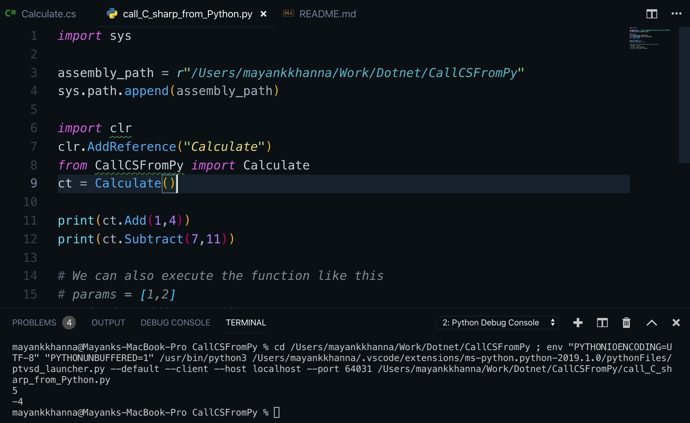

# CALLING C# CODE FROM PYTHON

This is a simple execution of the code, where we can execute a Code of a Calculator written in C# by calling it in Python.

For this purpose we are using [Pythonnet](https://github.com/pythonnet)

There are some pre-requistes that need to be kept in mind before executing the code:

1. You must be aware of how C# works and how to execute a C# Code.
2. You must know how to create a `.dll` file and what is its use.
3. Must be familiar with Python and how to import and use external modules.
4. Patience and Will to make the code run.

## Getting Started

1. Firstly write a very simple code to execute Addition and Subtraction of 2 numbers, in C#.

2. Now create a `.dll` file for the C# class using `csc -target:library Calculate.cs`

3. After that, install `pythonnet` using `pip install pythonnet`. For more reference on how to install pythonnet and if you face any errors, refer [here](http://pythonnet.github.io/).

4. After the installation of `pythonnet`, write the code to call C# function in Python.

5. For using the `.dll` file, use `sys.path` and mention the correct path for the `Calculate.dll` file in this case.

6. After writing the code in the python file, press `F5` to run the debugger and execute the code.

7. You should you be able to see an output like this:

---

## References:

1. [Pythonnet](http://pythonnet.github.io/)
2. [C#](https://docs.microsoft.com/en-us/dotnet/csharp/)
3. [Python](https://www.python.org/) 
